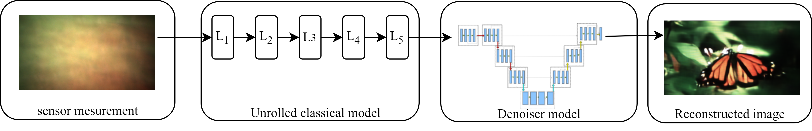

## DeepLIR: Attention-based approach for Mask-Based Lensless Image Reconstruction
[Paper](https://openaccess.thecvf.com/content/WACV2024W/VAQ/papers/Poudel_DeepLIR_Attention-Based_Approach_for_Mask-Based_Lensless_Image_Reconstruction_WACVW_2024_paper.pdf)

Official PyTorch implementation of DeepLIR. Code was modified from [this repo](https://github.com/Waller-Lab/LenslessLearning)
### Project Structure
- `helper`: This directory consists of helper functions.
- `models`: This directory contains files required for defining the ADMM model and U-Net, a U-Net architecture with several modifications including transformer attention, and anti-aliasing down/up-sampling.
- `samples_images`: Contains sample images to test the code.
- `train.py`: Contains training code.
- `result_test.py`: Evaluation script.
- `Reconstruction_demo.ipynb`: Jupyter notebook for reconstruction demo.

